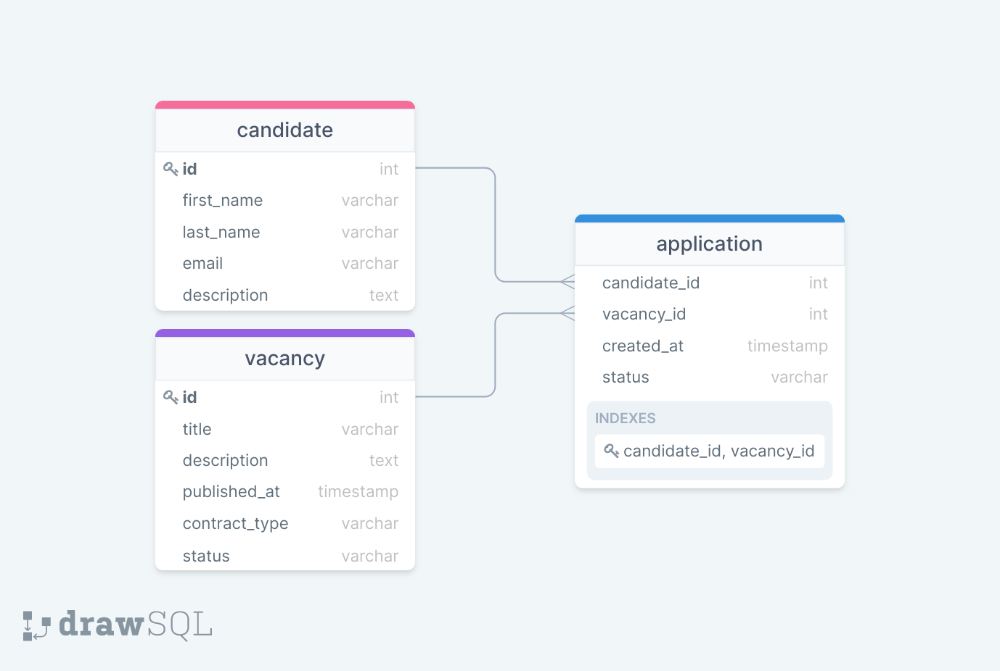

# Hello 👋

## Introduction

Te voilà prêt.e à passer le test technique de chez Flatchr.
Le test que nous avons concu est volontairement ambitieux par rapport au
temps imparti et nous en avons pleinement conscience.

Nous allons pouvoir évaluer tes compétences en front mais aussi en back.

Durant toute la phase du test, tu seras accompagné.e par un des développeurs de l'équipe.
Son rôle est de s'assurer que tu puisses effectuer le test dans les meilleures conditions.

**La durée du test est d'1h30.**

## Stack technique

**Pour la partie front:**
- React.js
- Bootstrap

**Pour la partie back:**
- Node.js
- Express
- [Better-sqlite3](https://github.com/WiseLibs/better-sqlite3)

## Pré-requis

Afin de pouvoir réaliser le test tu auras besoin :

- d'avoir node installé
- un compte git et que celui-ci soit configuré pour l'utiliser
- ton éditeur de code préféré

## Configuration du test technique

### Récupérer le projet

Tu dois d'abord récupérer le projet qui est hébergé sur [Gitlab](https://gitlab.com/flatchr/public/full-stack-exercise.git)

### Setup du projet

Le projet repose sur deux serveurs.
Côté front nous avons [webpack dev server](https://webpack.js.org/configuration/dev-server/) qui nous permet le *hot and live reloading*.
Côté back, c'est un serveur node qui est utilisé avec [nodemon](https://nodemon.io/) qui propose les mêmes mécaniques de rechargement lorsque le code est modifié.

```bash
# Go inside the directory
cd full-stack-exercise

# Install dependencies
npm install

# Setup SQLite3 database
npm run setup-db

# Start development server
npm run dev
```

### Documentation

Structure des dossiers:

Dans le dossier **src** nous avons deux dossiers principaux:
- **client** : utilisé pour la partie front end
- **server** : utilisé pour la partie back end


[Webpack dev server](https://webpack.js.org/configuration/dev-server/)

Webpack dev server nous fournit un serveur de developpement avec le rechargement automatique de la page dès que le code est modifié sur la partie front du projet.

La partie de configuration `devServer` contient la configuration requise requise pour l'execution du serveur.

```js
devServer: {
    port: 3000,
    open: true,
    proxy: {
        "/api": "http://localhost:8080"
    }
}
```

**port** : définit le port à utiliser

**open** : si définit à `true` la page d'accueil va automatiquement s'ouvrir

**proxy** : utile dans le cas où nous effectuons des requêtes cross domain


### Base de données

Après avoir executé :

```bash
npm run setup-db
```

Un fichier `.db` est créé dans `/src/server/database`

Il est possible, si tu le souhaites, de visualiser les données de la base grâce à [SQLite viewer](https://inloop.github.io/sqlite-viewer/)



`vacancy.contract_type` doit être de type `['cdi', 'cdd', 'internship']`

`vacancy.status` doit être de type `['opened', 'closed']`

`application.status` doit être de type `['to_call', 'to_meet', 'recruited', 'abandoned']`


## Dis moi ce que je dois faire !


Pour la partie front, des visuels sont disponibles sur [Figma](https://www.figma.com/file/kRdPJTVUXNLOcIpLO360p9/Flatchr---Test-2023?node-id=0%3A1) pour t'aider si tu manques d'inspiration !

Voilà tes objectifs pour ton test technique :

- [ ] Lancer le projet

**Pour la partie Front**
- [ ] Réaliser un Kanban composé de **4 colonnes**
- [ ] Réaliser une carte par candidat, sur la carte doivent figurer les informations suivantes : Nom, prénom, email, date et un select pour déplacer le candidat.
- [ ] Le select pour déplacer le candidat doit permettre de choisir une colonne vers lequel affecter le candidat

**Pour la partie API**
- [ ] Ajouter un candidat - il est possible de le faire via Postman pour réaliser cette partie
- [ ] Déplacer un candidat


## Livraison du test
---
Pour nous rendre ton test technique, tu dois le faire sous forme de merge request sur Gitlab.

Nous te souhaitons bon courage !
